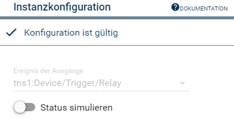

# ONVIF Digital Output
Bildet Digitale Ausgänge (Relays) in Symcon ab.  

## Inhaltsverzeichnis  <!-- omit in toc -->  

- [1. Funktionsumfang](#1-funktionsumfang)
- [2. Vorraussetzungen](#2-vorraussetzungen)
- [3. Software-Installation](#3-software-installation)
- [4. Einrichten der Instanzen in IP-Symcon](#4-einrichten-der-instanzen-in-ip-symcon)
- [5. Statusvariablen und Profile](#5-statusvariablen-und-profile)
  - [Statusvariablen](#statusvariablen)
- [6. WebFront](#6-webfront)
- [7. PHP-Befehlsreferenz](#7-php-befehlsreferenz)

## 1. Funktionsumfang

* Empfang von Statusmeldungen der Digitalen Ausgängen von ONVIF-Geräten.  
* Ansteuern der Digitalen Ausgänge über Symcon.  

## 2. Vorraussetzungen

* IP-Symcon ab Version 5.5
* Kameras oder Video-Encoder mit ONVIF Profil S Unterstützung.
* Geräte müssen über mindestens einen Digitalen Ausgang (bzw. Relais) verfügen.  

## 3. Software-Installation

* Über den Module Store das  ['ONVIF'-Modul](../README.md) installieren.

## 4. Einrichten der Instanzen in IP-Symcon

 Unter 'Instanz hinzufügen' ist das 'ONVIF Digital Output'-Modul unter dem Hersteller 'ONVIF' aufgeführt.  
  

 Es wird empfohlen diese Instanz über die dazugehörige Instanz des [Configurator-Moduls](../ONVIF%20Configurator/README.md) von diesem Geräte anzulegen.  
 
__Konfigurationsseite__:

  

| Name          | Text                    | Beschreibung                                                                                                                                                                           |
| ------------- | ----------------------- | -------------------------------------------------------------------------------------------------------------------------------------------------------------------------------------- |
| EventTopic    | Ereignisse der Ausgänge | Auswahl des Ereignis-Pfad ab welchen Ereignisse empfangen und verarbeitet werden.                                                                                                      |
| EmulateStatus | Status simulieren       | Wenn aktiviert, wird die Statusvariable in Symcon auf den neuen Wert gesetzt, sobald ein Schaltbefehl erfolgreich übertragen wurde. Sonst wird nur über ankommende Ereignisse gesetzt. |

Der Ereignis-Pfad wird bei Digital-Outputs versucht automatisch zu erkennen, funktioniert dies nicht, ist das Eingabefeld aktiv und das Ereignis muss manuell ausgewählt werden.  

## 5. Statusvariablen und Profile

Die Statusvariablen werden automatisch angelegt und erhalten das `~Switch` Profil. Das Löschen einzelner Statusvariablen kann zu Fehlfunktionen führen.  


### Statusvariablen

| Name                                                | Typ  | Beschreibung                                                               |
| --------------------------------------------------- | ---- | -------------------------------------------------------------------------- |
| je nach Name des Relay-Token aus dem Onvif-Ereignis | bool | Für jeden bekannten Output wird eine passende Variable in Symcon erstellt. |

## 6. WebFront

Die Statusvariablen haben eine hinterlegte Standardaktion und somit können die Ausgänge direkt aus dem WebFront bedient werden. 

Die direkte Darstellung der Statusvariablen ist möglich; es wird aber empfohlen mit Links zu arbeiten.  

## 7. PHP-Befehlsreferenz

```php
boolean ONVIF_SetRelayOutputState(integer $InstanzID, string $Ident, bool $Value);
```
De/Aktiviert den in `$Ident` übergeben Ausgang, je nach übergebenen Wert in `$Value`.  
Konnte der Befehl erfolgreich ausgeführt werden, wird `TRUE` zurückgegeben.  
Im Fehlerfall wird eine Warnung erzeugt und `FALSE` zurückgegeben.  

Beispiel:
`ONVIF_SetRelayOutputState(12345, '1', true);`  
Schalte Ausgang 1 an.