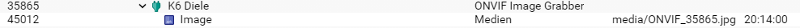
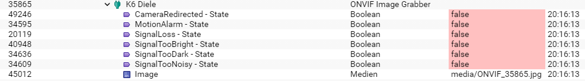

[](https://www.symcon.de/service/dokumentation/entwicklerbereich/sdk-tools/sdk-php/)
[]()
[](https://www.symcon.de/forum/threads/41251-IP-Symcon-5-5-%28Testing%29)  
[](https://creativecommons.org/licenses/by-nc-sa/4.0/)
[](https://github.com/Nall-chan/ONVIF/actions) [](https://github.com/Nall-chan/ONVIF/actions)  

# ONVIF Image Grabber
Speichert einzelne Snapshots als ein IPS Medien-Objekt.  

## Inhaltsverzeichnis <!-- omit in toc -->

- [ONVIF Image Grabber](#onvif-image-grabber)
  - [1. Funktionsumfang](#1-funktionsumfang)
  - [2. Vorraussetzungen](#2-vorraussetzungen)
  - [3. Software-Installation](#3-software-installation)
  - [4. Einrichten der Instanzen in IP-Symcon](#4-einrichten-der-instanzen-in-ip-symcon)
  - [5. Statusvariablen](#5-statusvariablen)
    - [Keine Events:](#keine-events)
    - [Mit Events:](#mit-events)
  - [6. WebFront](#6-webfront)
  - [7. PHP-Funktionsreferenz](#7-php-funktionsreferenz)
  - [8. Tips & Tricks](#8-tips--tricks)
    - [Bild bei Bewegung aktualisieren](#bild-bei-bewegung-aktualisieren)

## 1. Funktionsumfang

* Instanz für die einfache Integration eines Media-Bild-Objektes innerhalb von Symcon.  

## 2. Vorraussetzungen

* IP-Symcon ab Version 5.5
* Kameras oder Video-Encoder mit ONVIF Profil S Unterstützung.

## 3. Software-Installation

* Über den Module Store das ['ONVIF'-Modul](../README.md) installieren.  

## 4. Einrichten der Instanzen in IP-Symcon

 Unter 'Instanz hinzufügen' ist das 'ONVIF Image Grabber'-Modul unter dem Hersteller 'ONVIF' aufgeführt.
  

 Es wird empfohlen diese Instanz über die dazugehörige Instanz des [Configurator-Moduls](../ONVIF%20Configurator/README.md) von diesem Geräte anzulegen.  
 
__Konfigurationsseite__:

  

| Name        | Text                       | Beschreibung                                                                                                  |
| ----------- | -------------------------- | ------------------------------------------------------------------------------------------------------------- |
| VideoSource | Videoquelle                | Auswahl der Videoquelle                                                                                       |
| Profile     | Stream-Profil              | Auswahl des Profils                                                                                           |
| Intervall   | Interval                   | Intervall in Sekunden wann das Bild neu geladen werden soll.                                                  |
| UseCaching  | Benutze In-Memory Cache    | Speichert die Bilder im RAM des System und schreibt sie nur beim beenden des Dienstes auf das Speichermedium. |
| EventTopic  | Ereignisse der Videoquelle | Auswahl des Ereignis-Pfad ab welchen Ereignisse empfangen und verarbeitet werden (*).                             |

(*)  _Durch eine Änderung des Ereignis-Pfad werden die alten Statusvariablen hinfällig und müssen manuell gelöscht werden._   

## 5. Statusvariablen

Es wird automatisch ein Media-Objekt vom Typ Bild angelegt.  
Weitere Statusvariablen, basierend auf den Ereignissen, werden automatisch angelegt.  

### Keine Events:  
  

### Mit Events:  
  

| Name    | Typ      | Beschreibung                                                                                |
| ------- | -------- | ------------------------------------------------------------------------------------------- |
| Image   | Media    | IPS-Medienobjekt Typ Bild mit dem Snapshot.                                                 |
| diverse | variable | Für jedes eintreffende Ereignis wird automatisch eine passende Variable in Symcon erstellt. |

Beispiele für Statusvariablen von Ereignisse (`EventTopics`) sind in der [Events-Instanz](../ONVIF%20Events/README.md#5-statusvariablen) zu finden.
Es ist zu beachten das die Image-Grabber Instanz Event-Quellen auf Basis der konfigurierten Videoquelle (`VideoSource`) filtert. Somit werden z.B. Signalverlust (`VideoLost`) Events mit Bezug auf eine Videoquelle auch in der richtigen Instanz verarbeitet.  

## 6. WebFront

Die direkte Darstellung des Medien-Objektes und der eventuellen Statusvariablen von Ereignissen ist möglich; es wird aber empfohlen mit Links zu arbeiten.  

## 7. PHP-Funktionsreferenz

``` php
boolean ONVIF_UpdateImage(integer $InstanzID)
```
Holt ein neues Bild vom dem Gerät und speichert es im Medien-Objekt.  
Im Fehlerfall wird eine Warnung erzeugt und `false` zurück gegeben, sonst `true`.

## 8. Tips & Tricks

### Bild bei Bewegung aktualisieren  
Es soll ein Bild geladen werden, sobald der Videosensor auslöst.  

Hierzu ist unter `Ereignisse der Videoquelle` das Topic des Videosensor ausgewählt worden.
Die Variable trägt in diesem Beispiel den Namen `State`.  

Es wird ein neues `auslösendes Ereignis` in Symcon erstellt.
Als `Auslösende Variable` wird die `State` Variable des Videosensors ausgewählt.  
Bei `Auslöser` wird `bestimmter Wert` und bei `Wert` wird `True` eingetragen.
Damit eine wiederholte Auslösung des Videosensors auch ein neues Bild lädt, wird bei `Nachfolgende Ereignisse ausführen` auch `...wiederholt erfüllte Bedingung` ausgewählt.  

Das Ereignis muss jetzt noch eine Aktion erhalten, damit es das laden eines neuen Bildes vom Gerät anstoßen kann.  

Also `Ziel` wird die Instanz des `ONVIF Image Grabber` gewählt, welcher das Bild aktualisieren soll.  
Der `Aktionstyp` bleibt auf `Schalte Instanz` und bei `Statusvariable der Instanz` wird `Erweitert` eingetragen.  
Die `Funktion` erhält dann noch den Eintrag `ONVIF_UpdateImage` und über `OK` wird das Ereignis gespeichert.  

