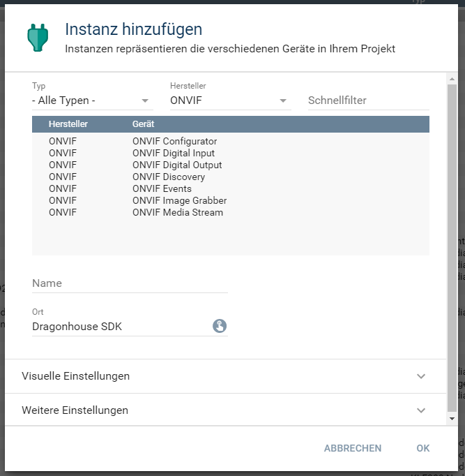
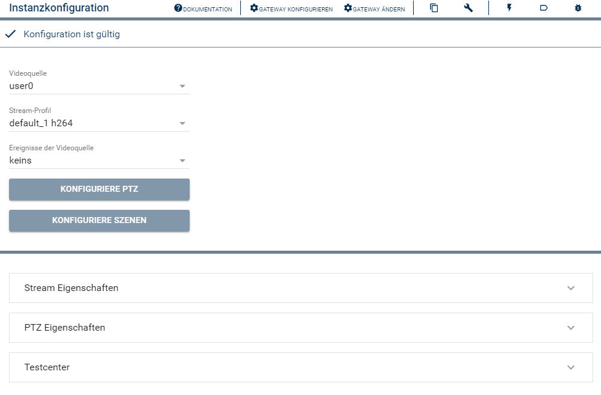
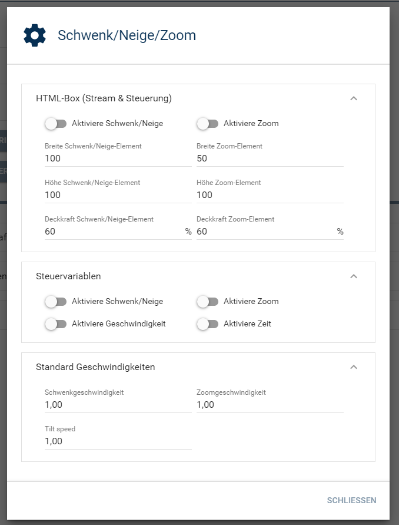
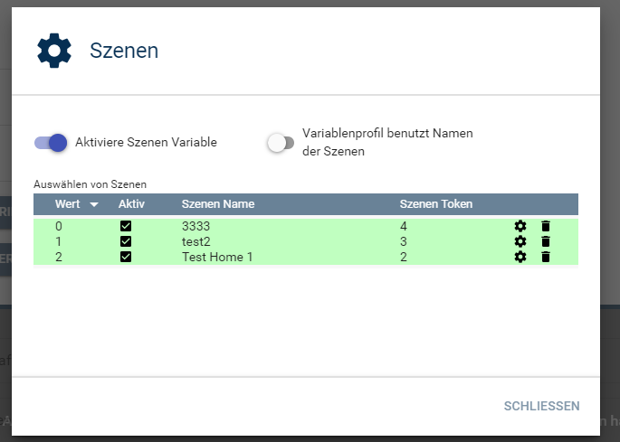
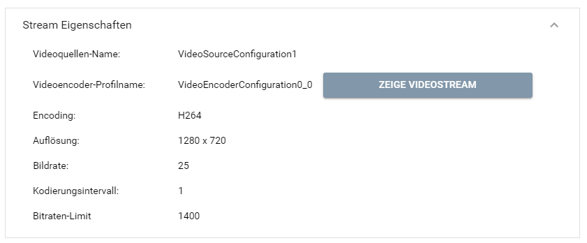
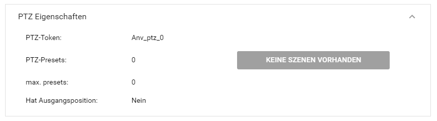
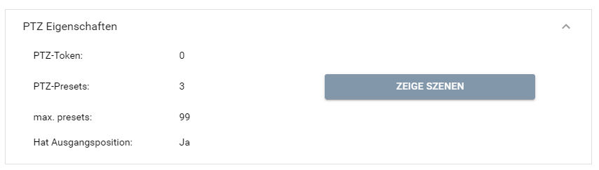
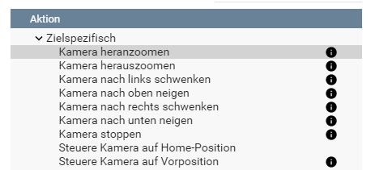

[](https://www.symcon.de/service/dokumentation/entwicklerbereich/sdk-tools/sdk-php/)
[](https://community.symcon.de/t/modul-onvif-profil-s-fuer-ip-kameras-und-encoder/52036)
[](https://www.symcon.de/service/dokumentation/installation/migrationen/v60-v61-q1-2022/)  
[](https://creativecommons.org/licenses/by-nc-sa/4.0/)
[](https://github.com/Nall-chan/ONVIF/actions)
[](https://github.com/Nall-chan/ONVIF/actions)  
[](#2-spenden)[](#2-spenden)  

# ONVIF Media Stream <!-- omit in toc -->
Konfiguriert ein IPS Medien-Objekt anhand der Geräte-Fähigkeiten.  

## Inhaltsverzeichnis <!-- omit in toc -->

- [1. Funktionsumfang](#1-funktionsumfang)
- [2. Voraussetzungen](#2-voraussetzungen)
- [3. Software-Installation](#3-software-installation)
- [4. Einrichten der Instanzen in IP-Symcon](#4-einrichten-der-instanzen-in-ip-symcon)
  - [Konfigurationsseite allgemein:](#konfigurationsseite-allgemein)
  - [Konfigurationsseite PTZ:](#konfigurationsseite-ptz)
    - [HTML-Box:](#html-box)
    - [Steuervariablen:](#steuervariablen)
    - [Standard Geschwindigkeiten:](#standard-geschwindigkeiten)
  - [Konfigurationsseite Szenen:](#konfigurationsseite-szenen)
  - [Testbereich Stream Eigenschaften:](#testbereich-stream-eigenschaften)
  - [Testbereich PTZ Eigenschaften:](#testbereich-ptz-eigenschaften)
- [5. Statusvariablen und Profile](#5-statusvariablen-und-profile)
  - [Statusvariablen](#statusvariablen)
  - [Profile](#profile)
- [6. WebFront](#6-webfront)
- [7. PHP-Funktionsreferenz](#7-php-funktionsreferenz)
  - [Pan/Tilt/Zoom Start-Befehle:](#pantiltzoom-start-befehle)
  - [Stop-Befehle](#stop-befehle)
  - [Befehle für Szenen / Vor-Positionen](#befehle-für-szenen--vor-positionen)
- [8. Aktionen](#8-aktionen)
- [9. Anhang](#9-anhang)
  - [1. Changelog](#1-changelog)
  - [2. Spenden](#2-spenden)
- [10. Lizenz](#10-lizenz)

## 1. Funktionsumfang

* Instanz für die einfache Integration eines Media-Stream-Objektes innerhalb von Symcon.  
* Stellt PTZ/SNZ (Schwenken / Neigen / Zommen) Funktionen bereit.  
* PTZ Funktionen für das WebFront.  
* PTZ Funktionen als PHP-Befehle und Aktionen.  
  
## 2. Voraussetzungen

* IP-Symcon ab Version 6.1
* Kameras oder Video-Encoder mit ONVIF Profil S und/oder Profil T Unterstützung.
* Geräte müssen h264 Streams bereitstellen.  
  (MJPEG/JPEG/h265 wird von Symcon nicht über RTSP unterstützt!)  
* PTZ Overlay wird offiziell nur für das WebFront unterstützt.  
  
## 3. Software-Installation

* Dieses Modul ist Bestandteil der [ONVIF-Library](../README.md#3-software-installation).  

## 4. Einrichten der Instanzen in IP-Symcon

 Unter 'Instanz hinzufügen' ist das 'ONVIF Media Stream'-Modul unter dem Hersteller 'ONVIF' aufgeführt.  
  

 Es wird empfohlen diese Instanz über die dazugehörige Instanz des [Configurator-Moduls](../ONVIF%20Configurator/README.md) von diesem Geräte anzulegen.  
 
### Konfigurationsseite allgemein:  

  
| Name        | Text                       | Beschreibung                                                                          |
| ----------- | -------------------------- | ------------------------------------------------------------------------------------- |
| VideoSource | Videoquelle                | Auswahl der Videoquelle                                                               |
| Profile     | Stream-Profil              | Auswahl des Profils                                                                   |
| EventTopic  | Ereignisse der Videoquelle | Auswahl des Ereignis-Pfad ab welchen Ereignisse empfangen und verarbeitet werden. (*) |

(*)  _Durch eine Änderung des Ereignis-Pfad werden die alten Statusvariablen hinfällig und müssen manuell gelöscht werden._  

### Konfigurationsseite PTZ:  

__Diese Funktionen sind nur verfügbar, wenn das Gerät PTZ-Eigenschaft gemeldet hat.__  

  
#### HTML-Box:  
Es besteht die Möglichkeit PTZ Steuerelemente als Overlay im Video-Stream darzustellen.  
Diese Funktion wird über eine String-Variable mit HTMLBox-Profil, für die Darstellung, und einen Webhook  für die Steuerung, realisiert.  
Das Video-Stream wird durch das Media-Objekt bereitgestellt und wird ebenso wie die Steuerung mit einem temporären Token abgesichert.  

| Name                  | Typ     | Text                            |
| --------------------- | ------- | ------------------------------- |
| EnablePanTiltHTML     | boolean | Aktiviere Schwenk/Neige         |
| EnableZoomHTML        | boolean | Aktiviere Zoom                  |
| PanTiltControlWidth   | integer | Breite Schwenk/Neige-Element    |
| PanTiltControlHeight  | integer | Höhe Schwenk/Neige-Element      |
| PanTiltControlOpacity | integer | Deckkraft Schwenk/Neige-Element |
| ZoomControlWidth      | integer | Breite Zoom-Element             |
| ZoomControlHeight     | integer | Höhe Zoom-Element               |
| ZoomControlOpacity    | integer | Deckkraft Zoom-Element          |

_Sind beide Steuerelemente deaktiviert, wird die Statusvariable `PTZControlHtml` automatisch entfernt und der Webhook gelöscht._  

#### Steuervariablen:  
Für eine Steuerung ohne Overlay, aus den Apps oder per [`RequestAction`](https://www.symcon.de/service/dokumentation/befehlsreferenz/variablenzugriff/requestaction/) können Statusvariablen aktiviert werden.  

| Name                  | Typ     | Text                      |
| --------------------- | ------- | ------------------------- |
| EnablePanTiltVariable | boolean | Aktiviere Schwenk/Neige   |
| EnableZoomVariable    | boolean | Aktiviere Zoom            |
| EnableSpeedVariable   | boolean | Aktiviere Geschwindigkeit |
| EnableTimeVariable    | boolean | Aktiviere Zeit            |

Die Statusvariablen `Geschwindigkeit` und `Zeit` sind dabei sowohl für das Schenken/Neigen, als auch für den Zoom zuständig.  

_Sollte die Kamera bei verschiedenen Werten von `Geschwindigkeit` sich immer gleich schnell bewegen, so wird dieser Wert von der Kamera nicht ausgewertet und ignoriert._

#### Standard Geschwindigkeiten:  

__Es gibt keine Anhaltpunkte welche Werte hier sinnvoll sind.__  

| Name             | Typ   | Text                    |
| ---------------- | ----- | ----------------------- |
| PanDefaultSpeed  | float | Geschwindigkeit Schwenk |
| TiltDefaultSpeed | float | Geschwindigkeit Neige   |
| ZoomDefaultSpeed | float | Geschwindigkeit Zoom    |

### Konfigurationsseite Szenen:  

__Diese Funktionen sind nur verfügbar, wenn das Gerät PTZ-Eigenschaft und Szenen gemeldet hat.__  

  

| Name                 | Typ     | Text                                     |
| -------------------- | ------- | ---------------------------------------- |
| EnablePresetVariable | boolean | Aktiviere Szenen Variable                |
| EnablePresetProfile  | boolean | Variablenprofil benutzt Namen der Szenen |
| PresetProfile        | string  | Liste der Szenen                         |

Durch das Aktiveren der Statusvariable für Szenen, ist es möglich in dem Gerät abgespeicherte PTZ-Positionen bzw. Szenen über Symcon aufzurufen bzw. anzufahren.  
Die Verfügbaren Szenen werden dabei in der Tabelle dargestellt und können mit der Auswahlbox bei `Aktiv` dem Variablenprofil dieser Statusvariable hinzugefügt oder entfernt werden.  

_Wird `EnablePresetVariable` deaktiviert, so wird auch die dazugehörige Statusvariable mitsamt Profile gelöscht._  

### Testbereich Stream Eigenschaften:  

  

Dieser Bereich gibt eine Übersicht über den benutzen Stream des Gerätes aus.  
Nicht alle Geräte liefern hier sinnvolle Informationen; so wird z.B. Bildrate oder auch das Bitraten-Limit mit 0 angegeben.  
Mit der Schlatfläche `Zeige Videostream` ist eine Vorschau vom Stream in der Konsole möglich.  

### Testbereich PTZ Eigenschaften:  

  
  
Dieser Bereich enthält alle PTZ Fähigkeiten welche vom Gerät gemeldet wurden.  
Unterstützt das Gerät Szenen / Festpositionen, so können Diese ebenfalls angezeigt werden.

## 5. Statusvariablen und Profile

### Statusvariablen
Es wird automatisch ein Media-Objekt vom Typ Stream angelegt.  
Die Statusvariablen werden automatisch gemäß der [Instanzkonfiguration](#konfigurationsseite-allgemein) angelegt. Das Löschen einzelner kann zu Fehlfunktionen führen.  

| Ident          | Initial Name           | Typ          | Beschreibung                                                                                |
| -------------- | ---------------------- | ------------ | ------------------------------------------------------------------------------------------- |
| Stream         | Stream                 | Media-Objekt | IPS-Medienobjekt Typ Stream mit der RTSP-URL.                                               |
| PTZControlHtml | PTZ-Steuerung WebFront | string       | HTML-Box für Stream und PTZ-Steuerung                                                       |
| PT             | Bewegen                | integer      | Schwenk/Neige-Steuerung                                                                     |
| ZOOM           | Zoom                   | integer      | Zoom-Steuerung                                                                              |
| SPEED          | Geschwindigkeit        | float        | Steuerung der Geschwindigkeit                                                               |
| TIME           | Zeit                   | float        | Steuerung der Ansteuerdauer bei Schwenk/Neige/Zoom                                          |
| PRESET         | Szene                  | integer      | Auswahl einer Vorposition / Szene                                                           |
| diverse        | diverse                | variable     | Für jedes eintreffende Ereignis wird automatisch eine passende Variable in Symcon erstellt. |

Beispiele für Statusvariablen von Ereignisse (`EventTopics`) sind in der [Events-Instanz](../ONVIF%20Events/README.md#5-statusvariablen) zu finden.
Es ist zu beachten das die Image-Grabber Instanz Event-Quellen auf Basis der konfigurierten Videoquelle (`VideoSource`) filtert. Somit werden z.B. Signalverlust (`VideoLost`) Events mit Bezug auf eine Videoquelle auch in der richtigen Instanz verarbeitet.  

### Profile  
| Name                       | Typ     | verwendet von Statusvariablen |
| -------------------------- | ------- | ----------------------------- |
| ONVIF.PanTilt              | integer | PT                            |
| ONVIF.Zoom                 | integer | ZOOM                          |
| ONVIF.Speed                | float   | SPEED                         |
| ONVIF.Time                 | float   | TIME                          |
| ONVIF.Preset.`<InstanzID>` | integer | PRESET                        |

## 6. WebFront

Die direkte Darstellung der Statusvariablen ist möglich; es wird aber empfohlen mit Links zu arbeiten.  

## 7. PHP-Funktionsreferenz

__Grundsätzlich können alle bedienbaren Statusvariablen per [`RequestAction`](https://www.symcon.de/service/dokumentation/befehlsreferenz/variablenzugriff/requestaction/) angesteuert werden, so das hier keine speziellen Instanz-Funktionen benutzt werden müssen.__  

----------
### Pan/Tilt/Zoom Start-Befehle:  

Für die Bewegung in jede Richtung stehen entsprechende PHP-Funktionen zur Verfügung.  
Dabei gibt es immer einen Befehl welcher eine Bewegung startet, mit Standard-Geschwindigkeit und ohne Zeitlimit.  
Zusätzlich gibt es jeweils einen Befehl mit einem Zeitlimit, wie lange eine Bewegung ausgeführt werden soll und einen mit welcher Geschwindigkeit die Bewegung erfolgen soll.  
Und einen Befehl welcher beide Parameter akzeptiert, sowohl Geschwindigkeit als auch Dauer der Bewegung.  
Die Parameter `Time` und `Speed` werden in den Geräten verarbeitet. Es ist nicht sichergestellt, dass jedes Geräte diese Parameter unterstützt, oder welche Wertebereiche gültig sind.  

```php
    ONVIF_MoveLeft(int $InstanzID)
    ONVIF_MoveLeftTime(int $InstanzID, float $Time)
    ONVIF_MoveLeftSpeed(int $InstanzID, float $Speed)
    ONVIF_MoveLeftSpeedTime(int $InstanzID, float $Speed, float $Time)

    ONVIF_MoveRight(int $InstanzID)
    ONVIF_MoveRightSpeed(int $InstanzID, float $Speed)
    ONVIF_MoveRightTime(int $InstanzID, float $Time)
    ONVIF_MoveRightSpeedTime(int $InstanzID, float $Speed, float $Time)

    ONVIF_MoveUp(int $InstanzID)
    ONVIF_MoveUpSpeed(int $InstanzID, float $Speed)
    ONVIF_MoveUpTime(int $InstanzID, float $Time)
    ONVIF_MoveUpSpeedTime(int $InstanzID, float $Speed, float $Time)

    ONVIF_MoveDown(int $InstanzID)
    ONVIF_MoveDownSpeed(int $InstanzID, float $Speed)
    ONVIF_MoveDownTime(int $InstanzID, float $Time)
    ONVIF_MoveDownSpeedTime(int $InstanzID, float $Speed, float $Time)

    ONVIF_ZoomNear(int $InstanzID)
    ONVIF_ZoomNearSpeed(int $InstanzID, float $Speed)
    ONVIF_ZoomNearTime(int $InstanzID, float $Time)
    ONVIF_ZoomNearSpeedTime(int $InstanzID, float $Speed, float $Time)

    ONVIF_ZoomFar(int $InstanzID)
    ONVIF_ZoomFarSpeed(int $InstanzID, float $Speed)
    ONVIF_ZoomFarTime(int $InstanzID, float $Time)
    ONVIF_ZoomFarSpeedTime(int $InstanzID, float $Speed, float $Time)
```
----------
### Stop-Befehle  

Es ist jederzeit Möglich eine Bewegung zu beenden, dafür existieren drei verschiedene PHP-Befehle.  
```php
    ONVIF_MoveStop(int $InstanzID)
```  
Beendet nur die Schwenk/Neige Bewegung.  

----------
```php
    ONVIF_ZoomStop(int $InstanzID)
```
Beendet nur einen Zoom.  

----------
```php
    ONVIF_StopPTZ(int $InstanzID)
```
Beendet sowohl Zoom als auch Schwenk/Neige.  

----------
### Befehle für Szenen / Vor-Positionen  

Befehle um in den Geräten abgespeicherte Szenen anzufahren.  
```php
    ONVIF_GotoPreset(int $InstanzID, int $PresetIndex)
```
Erwartet in `PresetIndex` den Index einer Szene, welche unter PTZ-Eigenschaft angezeigt wird.  
Dabei ist irrrelevant ob die Szene im dem VariablenProfil ONVIF.Preset.`<InstanzID>` vorhanden ist.  

----------
```php
    ONVIF_GotoPresetToken(int $InstanzID, string $PresetToken)
```
Erwartet in `PresetToken` den Token (als String) einer Szene, welche unter PTZ-Eigenschaft angezeigt wird.  
Es findet hier keine weitere Überprüfung statt, ob der Token valid ist oder nicht.  

----------
```php
    ONVIF_GotoPresetHomePosition(int $InstanzID)
```
Befehl zum Anfahren der Home-Position.  
  
## 8. Aktionen

__Grundsätzlich können alle bedienbaren Statusvariablen als Ziel einer [`Aktion`](https://www.symcon.de/service/dokumentation/konzepte/automationen/ablaufplaene/aktionen/) mit 'Auf Wert schalten' angesteuert werden, so das hier keine speziellen Aktionen benutzt werden müssen.__

Dennoch gibt es diverse Aktionen für die 'ONVIF Media Stream' Instanz.  
Wenn so eine Instanz als Ziel einer Aktion ausgewählt wurde, stehen folgende Aktionen zur Verfügung:  
  
* Steuere Kamera auf Home-Position
* Steuere Kamera auf Vorposition
* Kamera nach oben/unten neigen
* Kamera nach links/rechts schwenken
* Kamera stoppen
* Kamera heran/heraus zoomen

## 9. Anhang

### 1. Changelog

[Changelog der Library](../README.md#2-changelog)

### 2. Spenden

  Die Library ist für die nicht kommerzielle Nutzung kostenlos, Schenkungen als Unterstützung für den Autor werden hier akzeptiert:  

<a href="https://www.paypal.com/donate?hosted_button_id=G2SLW2MEMQZH2" target="_blank"></a>  

[](https://www.amazon.de/hz/wishlist/ls/YU4AI9AQT9F?ref_=wl_share) 

## 10. Lizenz

  IPS-Modul:  
  [CC BY-NC-SA 4.0](https://creativecommons.org/licenses/by-nc-sa/4.0/)  
